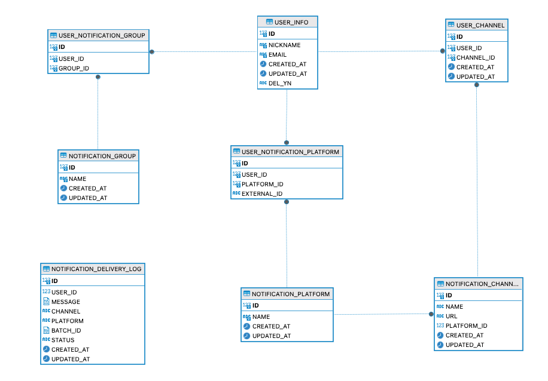

# 메시지 전송 서비스
Spring Kotlin 기반의 외부(슬랙, 텔레그림) 플랫폼에 메시지를 전송하는 서비스

## Tech Stack
<div>
    
    
    
</div>

<div>
    
    
    
</div>

<div>
    
    
</div>

### Tool
<div>
    
    
</div>

## 목차
- [실행방법](#실행방법)
- [시스템 아키텍처](#시스템-아키텍처)
- [ERD](#erd)
- [API 명세서](#api-명세서)
- [개선사항](#개선사항)

## 실행방법
1. 저장소 클론 [비공개]
    ```bash
    git clone https://github.com/jaydenchuljinlee/kakao-bank-notification
2. 빌드
    ```bash
    ./gradlew build
    ```
3. 애플리케이션 실행
    ```bash
    sh run.sh
    ```

## 시스템 아키텍처

### 회원
- 로그인 시에 슬랙 SSO 연동한다는 가정
- 로그인 API를 통해 로그인을 진행하게 되면 JWT 토큰을 OAuth로 받아온 토큰이라고 가정하고 Redis에 저장
- 토큰 정보는 사용자가 로그아웃한 후에 삭제되는 정보기 때문에 따로 영속화는 하지 않음

### 외부 플랫폼
- [외부 플랫폼] - [플랫폼 채널] - [회원] 관계 구성
- 외부 플랫폼 등록 시에 회원 정보를 Bulk Insert
    - 만약, 사용자가 많아서 시간이 걸리는 작업이라면 배치 서버나 프로시저를 통해 등록
        - 구조가 단순하여 데이터 양만 많을 경우 프로시저 사용
        - 구조가 복잡할 경우, 에러 처리 및 디버깅을 용이하게 하기위해 배치 서버 사용
    - 현재는 두 개의 플랫폼이 등록되어 있고 회원과 플랫폼이 연결되어있다고 가정
        - `domain-data.sql` 파일을 통해 데이터 초기화

### 알림 그룹
- [알림 그룹] - [회원] - [플랫폼 채널] 관계 구성
- 알림 그룹 생성과 알림 그룹에 참여 및 탈퇴 API 제공
- 알림 그룹 중복 생성에 대한 예외 처리 구현

### 알림 전송
- Mockup 서비스 생성
    - Slack, Telegram 등 확장 가능하도록 Interface로 연결
- 외부 서비스 장애 발생 시
    - 저장소에 외부 서비스 장애를 기록
    - 확장을 고려했을 때, 문서형 저장소에 저장하고 싶습니다.
- 외부 서비스 초당 처리 제한
    - 임시 Queue 서버 클래스 생성
        - 초당 처리 제한이 있기 때문에 바로 접근하는 것이 아니라, 이를 중개할 수 있는 서버가 필요하여 구현
    - Queue 서버 내부에서 Rate Limiting 전략을 통해 안정성있게 처리
        - Queue 서버는 N초에 한 번씩 Task를 실행하면서 Queue에서 M개를 뽑아 처리한다
        - 재시도 처리는 요구사항에서 배제되었기 때문에 Backoff 전략은 제외
- 알림 전송 여부 기록
    - 알림에 대한 대기, 성공, 실패 여부를 통해 추후 재시도 알람을 보낼 수 있도록 기록
    - 예외 발생 시, 예외 내용을 기록

## ERD



## API 명세서

### 사용자 생성 API
- **URL**: `/v1/users`
- **Method**: POST
- **Response**:
    ```json
    {
        "status": 200,
        "message": "사용자를 생성했습니다.",
        "data": {
                  "id": 102,
                  "nickname": "cheoljin2",
                  "email": "ironjin923@gmail.com",
                  "version": 0,
                  "delYn": "N",
                  "createdAt": "2024-07-30T13:42:40.437002545",
                  "updatedAt": "2024-07-30T13:42:40.437135087"
                }
    }
    ```
### 사용자 목록 조회 API
- **URL**: `/v1/users`
- **Method**: GET
- **Response**:
    ```json
    {
        "status": 200,
        "message": "사용자 목록을 조회했습니다.",
        "data": [
                  {
                    "id": 102,
                    "nickname": "cheoljin2",
                    "email": "ironjin923@gmail.com",
                    "version": 0,
                    "delYn": "N",
                    "createdAt": "2024-07-30T13:42:40.437002545",
                    "updatedAt": "2024-07-30T13:42:40.437135087"
                }
        ]
    }
    ```

### 그룹 생성 API
- **URL**: `/v1/groups?groupName={group_name}`
- **Method**: POST
- **Response**:
    ```json
    {
        "status": 200,
        "message": "그룹을 생성했습니다.",
        "data": {
                  "id": 1,
                  "name": "group_1",
                  "version": 0,
                  "createdAt": "2024-07-30T13:45:08.818697502",
                  "updatedAt": "2024-07-30T13:45:08.818725169"
                }
    }
    ```

### 그룹 사용자 추가 API
- **URL**: `/v1/groups/{group_id}/join?userId={user_id}`
- **Method**: POST
- **Response**:
    ```json
    {
        "status": 200,
        "message": "사용자를 그룹에 추가했습니다.",
        "data": null
    }
    ```

### 그룹 사용자 제거 API
- **URL**: `/v1/groups/{group_id}/leave?userId={user_id}`
- **Method**: POST
- **Response**:
    ```json
    {
        "status": 200,
        "message": "사용자를 그룹에서 제거했습니다.",
        "data": null
    }
    ```

### 알림 전송 API
- **URL**: `/v1/alerts`
- **Method**: POST
- **Request Body**:
    ```json
    {
        "target": [ "@user1", "@@team1", "@all" ],
        "severity": "normal",
        "message": "node1 down"
    }
    ```
- **Response**:
    ```json
    {
        "userCount": "128"
    }
    ```

## 개선사항
- Queue 서버 관련
  - Queue 서버 내부 작업 처리 로직과 스케줄링 로직의 혼합되어 테스트가 어려운 상황
  - 이를 작업 처리 - 스케줄링 클래스로 분리하여 구현하여 더 명확한 클래스 개념으로 바꿀 것
- Repository 관련
  - 확장성을 고려하여 인터페이스로 사용할 메서드만 구현할 것
